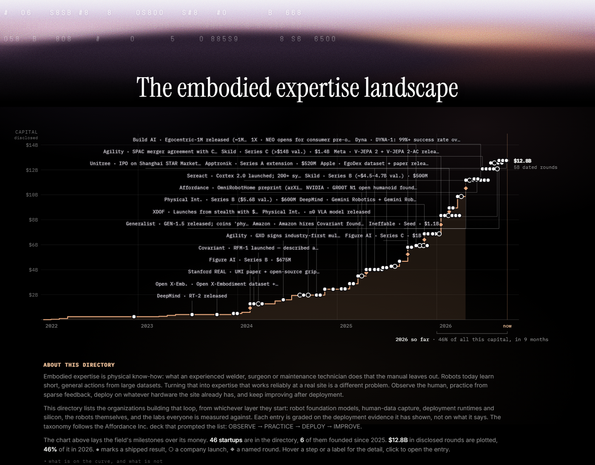
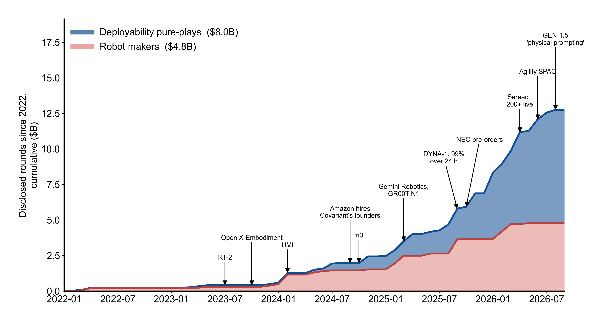
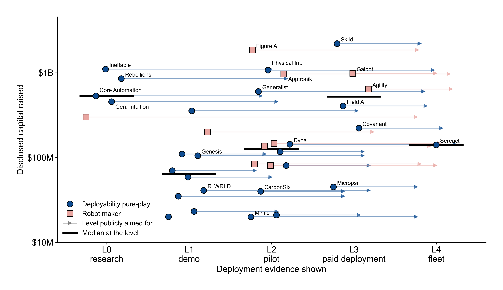
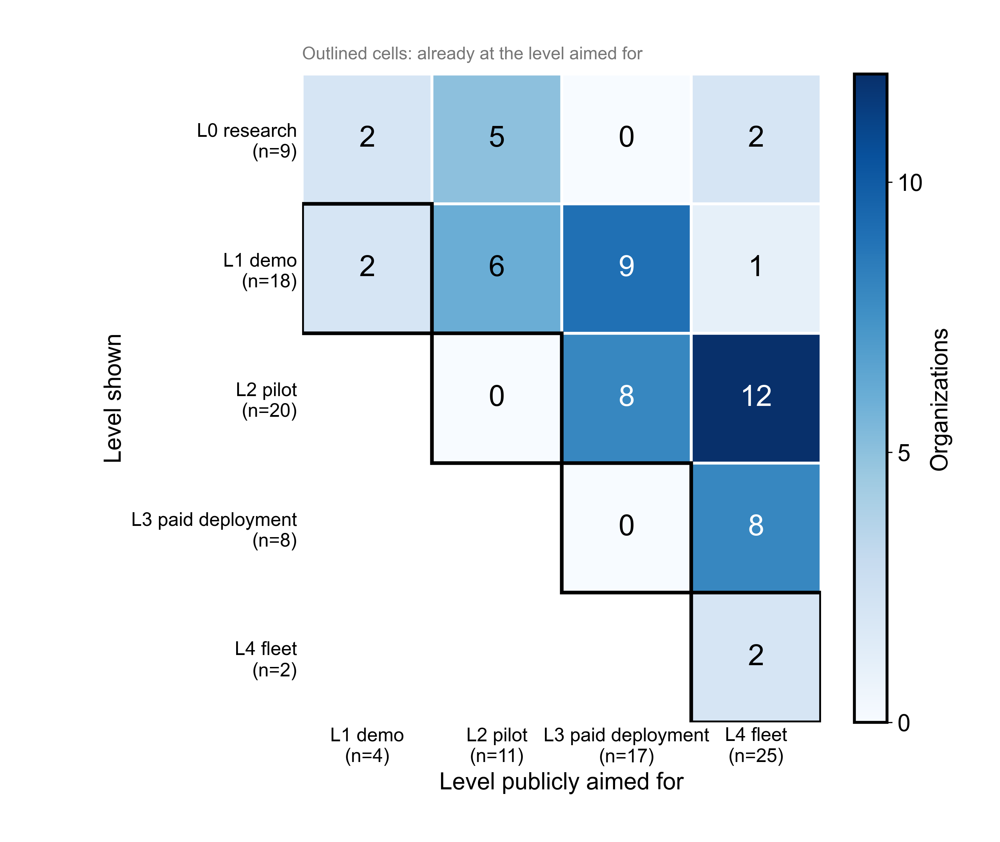
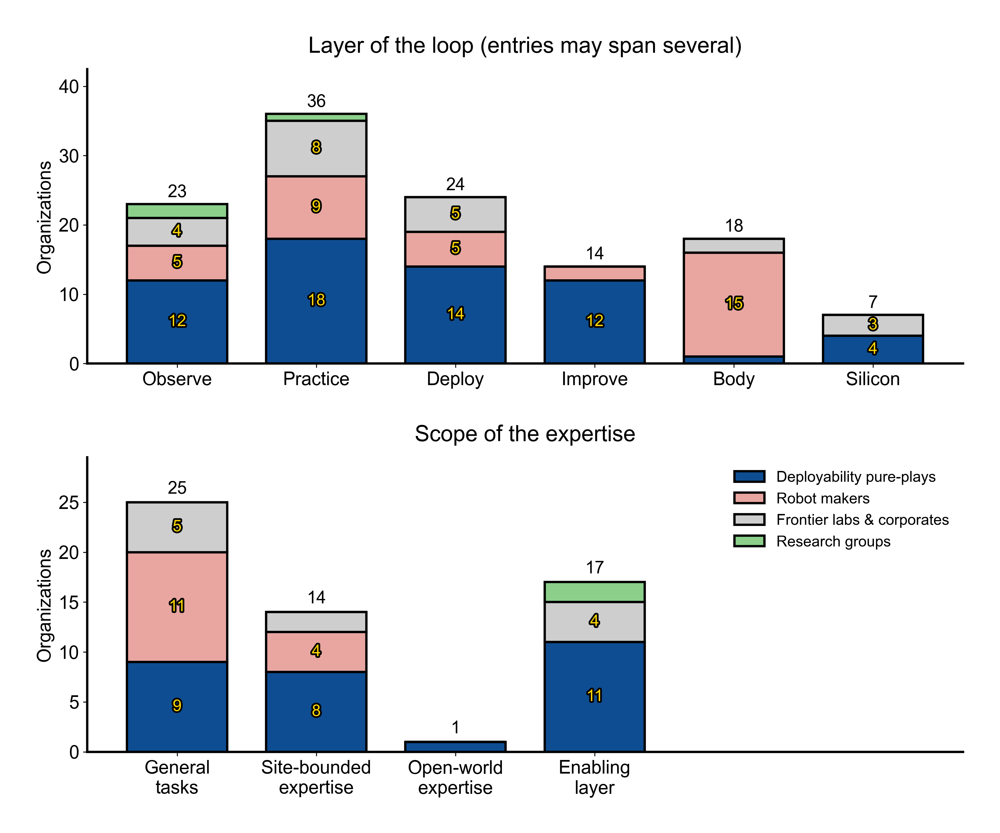

<a href="https://yurekami.github.io/embodied-expertise-list/"></a>

<h1 align="center">Embodied Expertise List</h1>

A cited directory of the organizations working on deployable embodied expertise: machines that learn physical know-how from humans, practice it, get deployed on real hardware at real sites, and keep improving from feedback. Each entry is graded on the deployment evidence it has publicly shown, with a dated source behind every figure.

**Live page:** https://yurekami.github.io/embodied-expertise-list/

## The taxonomy

The list follows the loop in Affordance Inc.'s deck (*Deployability Infra for Embodied Expertise*, v13): human data is where expertise starts, and reliability comes from practice and feedback after deployment.

| Layer | What it does |
| --- | --- |
| **Observe** | Capture human physical expertise as robot-learnable data (wearables, egocentric capture, teleoperation) |
| **Practice** | Learn the deployable algorithm: policies, simulation, RL, autoresearch on the whole stack |
| **Deploy** | Bridge the algorithm to the hardware a site already has: GPUs, edge boards, FPGAs, ASICs |
| **Improve** | Memory and continual learning from sparse human feedback after deployment |
| **Body** | The robot hardware itself |
| **Silicon** | Chips and FPGAs for robots |

Every entry also carries a **scope** badge from the deck's market map: **General tasks** (one policy for many objects and sites), **Site-bounded expertise** (the know-how of one plant, clinic or warehouse, made reliable there), **Open-world expertise** (field and outdoor work), or **Enabling layer**.

## The evidence scale

Claims in this field run ahead of evidence, so entries are graded on what they have shown (L) and what they publicly aim for (→ L):

| Level | Meaning |
| --- | --- |
| **L0** research | Papers, no robot at a customer site |
| **L1** demo | Lab or staged demos, videos, benchmarks |
| **L2** pilot | Robots working at a customer site; pilots or pilot fees |
| **L3** paid deployment | Recurring paid deployments at multiple sites |
| **L4** fleet | Hundreds of units in production, learning from deployment data |

Ranked entries are deployability-infra pure-plays that clear a scale / evidence / team bar. Robot makers, corporates and research groups sit outside the ranking; earlier-stage teams sit on the radar (◎). Every figure carries a confidence tag (● confirmed, ◐ reported, – unknown) and a dated source linked from the entry.

## The site

- **The takeoff chart** at the top: disclosed rounds across the field on one time axis, with shipped results (●), company launches (○) and named rounds (◆) placed along the curve. Frontier-lab, public-company and corporate capital is left out so startups share one scale.
- **The directory**: a table or card view of every organization, sortable by rank, capital, valuation and founding year, searchable by name or people, filterable by tag and country.
- **One page per organization**: what they build, the flagship, the team, the timeline, and every figure with its confidence tag and source.

## Figures

Drawn from `data/orgs.json` by `tools/figures.py`, in the house style of [figures4papers](https://github.com/ChenLiu-1996/figures4papers). PNG and PDF versions are in [`assets/figures/`](assets/figures); the page uses transparent dark variants of the same files.



*The takeoff, by kind of company.* Disclosed rounds since 2022 as a running total, deployability pure-plays stacked on robot makers, with field milestones placed on the curve. Same inclusion rule as the site's chart: no frontier labs, no public or corporate capital.



*Money against proof.* Disclosed capital against the deployment evidence shown, for startups with a disclosed total. Whiskers run to the level each one publicly aims for; bars mark the median at each level.

 

*Shown against aimed* (left): each organization's level on the evidence scale against the level it publicly aims for; outlined cells are already there. *Where the field crowds* (right): organizations per layer of the loop and per scope from the deck's market map, split by kind of organization.

## Repository

`index.html` is the entire site: one self-contained file with no dependencies. Open it directly in a browser, or serve the directory statically.

The data lives in `data/orgs.json` (entries, rounds, events, sources) and is embedded into `index.html` by:

```
python tools/build.py       # data/orgs.json + template.html -> index.html
python tools/figures.py     # data/orgs.json -> assets/figures/ (png + pdf, and .dark.png for the page)
```

`template.html` is the page without data; `tools/adapt.py` is the one-shot script that derived it from RSI List's `index.html`.

## Contributing

Corrections and additions are welcome. Open an issue or a pull request against `data/orgs.json`, and include a dated primary source for anything quantitative: a round, a valuation, a headcount, a shipped result.

## Credits

Built by [Daniel Kang](https://github.com/yurekami) for [Affordance Inc.](https://arxiv.org/abs/2606.28197), whose deck supplies the taxonomy. Format and code forked from [RSI List](https://rsi-list.com) by Jinyan Su, Jiabin Tang and Yu Shi (MIT), itself inspired by [RL List](https://www.rl-list.com).

## License

Code is released under the [MIT License](LICENSE). The dataset (entries, figures, timelines, sources) is licensed under [CC BY 4.0](https://creativecommons.org/licenses/by/4.0/); attribute as "Embodied Expertise List".
